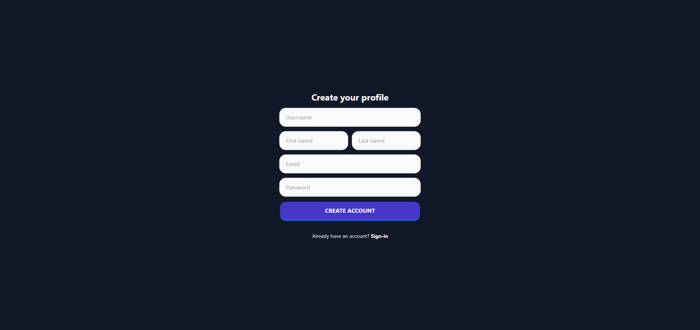
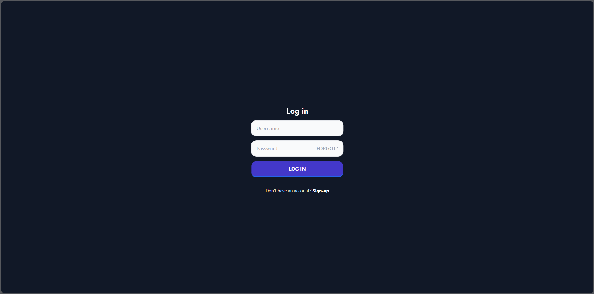
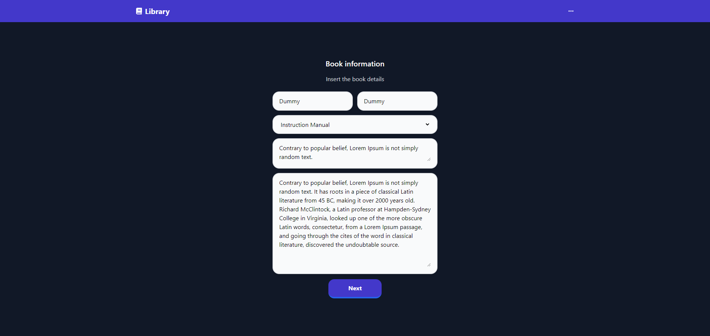
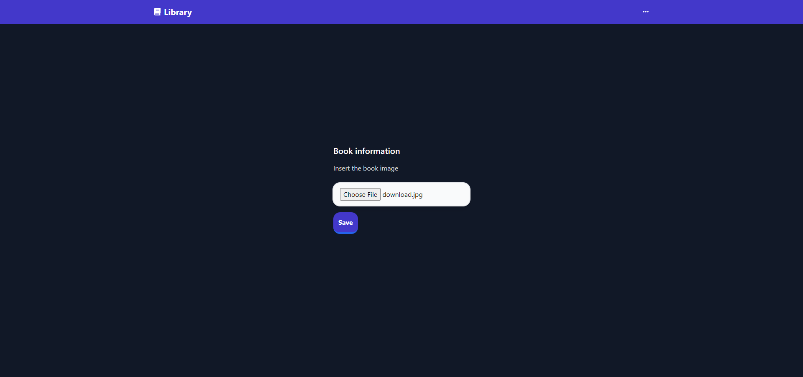
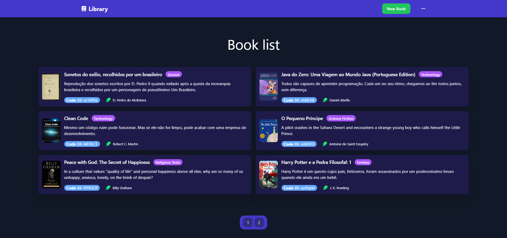
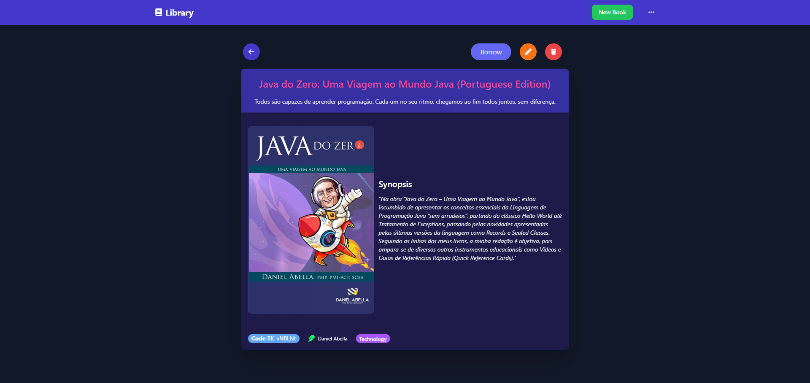
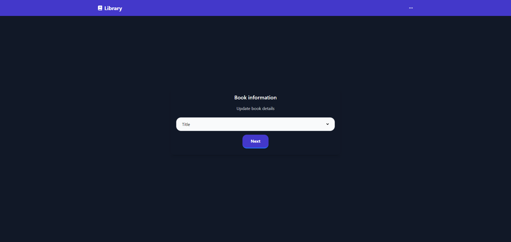
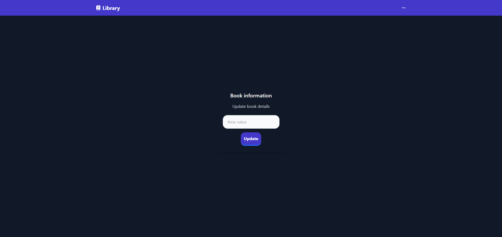
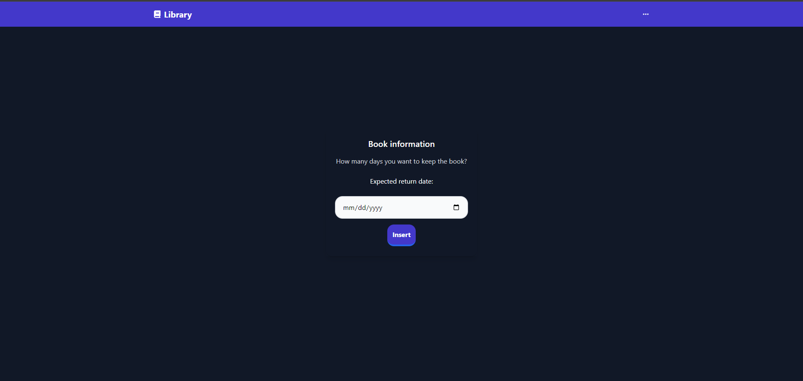
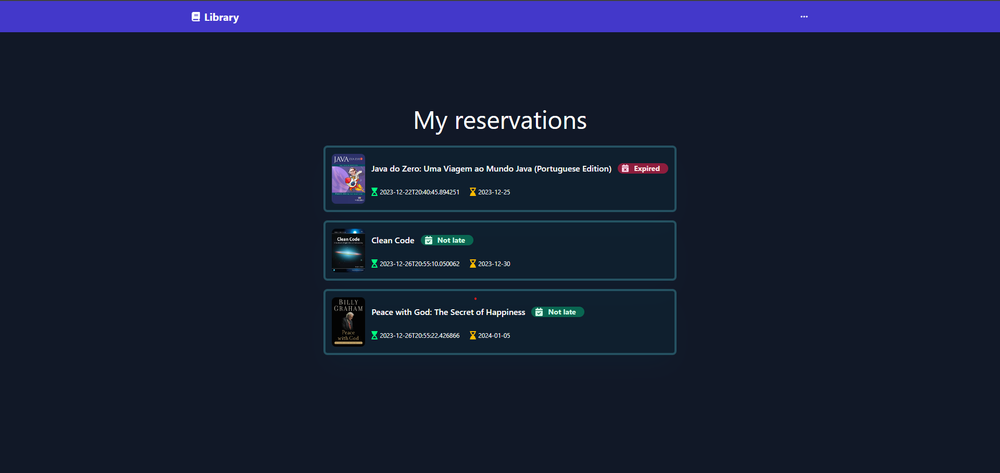

# Online Library

**Spring MVC and Thymeleaf Library system** 

> ⚠️ **Warning:** *The project is not intended to be well structured, as it was made just to play with Spring MVC. So don't expect the best code in the world haha **ITS TOTALLY "GO HORSE"🎠***

## Features

- Login and Registration.
- Add, list, update and delete books(CRUD).
- Borrow a book.
- Handle borrow.
- User and librarian view.

## Tech Stack

	<code></code>
	<code></code>
	<code></code>
	<code></code>
	<code></code>
	<code></code>

           
## Screenshots

#### User registration:

#### User login:

#### Book registration:

#### Book image upload:

#### Book list:

#### Book details:

#### Book update - Field selection:

#### Book update - Value insertion:

#### Book borrow - date selection:

#### User book reservations:

## License

Take a look at the project license - 📜 **[MIT](LICENSE.md)**